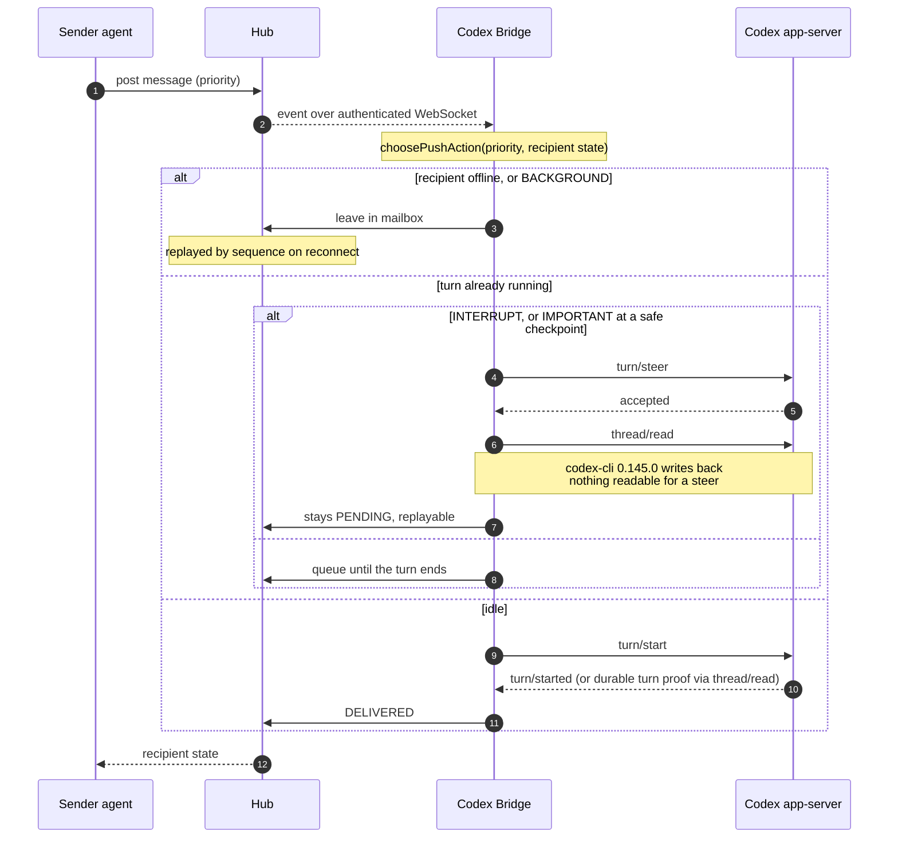
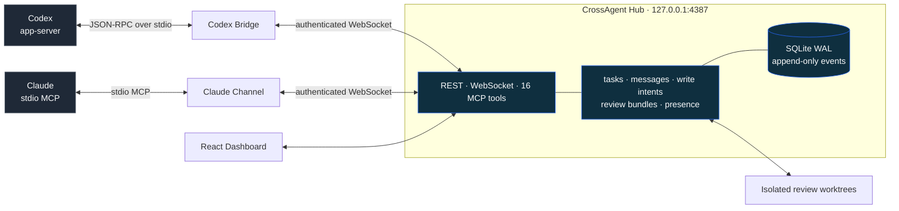

# CrossAgent Hub

**English** · [简体中文](./README.zh-CN.md)

[](https://github.com/ayanamislover/ayanamiAgent-Hub/actions/workflows/ci.yml)
[](LICENSE)


A local-first control plane that lets Codex and Claude coordinate tasks, prevent write conflicts,
exchange acknowledged messages, and review immutable code snapshots. The Hub never calls a model
itself and never stores a model's private reasoning — both agents keep their own runtime, and what
they share is identity, state, and an event stream that either can replay after a disconnect.

Built by [ayanamislover](https://github.com/ayanamislover). The product, the protocol, the CLI and
the packages are all CrossAgent — `crossagent`, `@crossagent/*`. Only the repository is still named
`ayanamiAgent-Hub`, so clone URLs and badge links keep that spelling.

## What it looks like

Every screenshot below is the disposable demo that `pnpm demo` seeds, not a real project.


_Overview — the active objective, both agents' field state, and the event stream as it arrives._


_Reviews — each bundle freezes a base and head SHA, a patch hash and the findings filed against it.
A review-required task cannot reach `DONE` while a blocking finding is open._


_Communications — priority decides how a message reaches a busy agent; delivery state only advances
on an explicit ACK, never on a successful transport write._

## Three things that make it different

**Delivery is proven, not assumed.** A transport write is never treated as delivery. The Bridge
advances a recipient to `DELIVERED` only after reading correlated evidence back out of the peer, and
the surfaces that cannot be confirmed on the Codex CLI it was measured against stay `PENDING` and
replayable rather than being reported as delivered.

**Review is evidence, not conversation.** A review bundle freezes a base SHA, a head SHA and a patch
hash. Findings are filed against that frozen snapshot, checked out into an isolated worktree, and a
review-required task cannot reach `DONE` while a blocking finding is open.

**Capability is probed, not inferred.** The Agents page shows the transport and capabilities
actually probed for each session rather than guessing them from a client version string, so an agent
whose CLI dropped a feature shows up as degraded instead of silently failing.

## Try it without two agents

```bash
pnpm demo
```

This seeds a disposable Hub under `output/demo` with a worked Codex × Claude collaboration —
three review rounds, findings of three severities, and the message thread around them. The content is
taken from the private development workspace this project was built in, anonymised, including one
round where the reviewer retracts its own blocking finding after measuring wrong.

It prints the commands to start the Hub against that data. Stop your own Hub first if you have one
running — a built workspace holds a single Hub runtime lease, so the port and data directory being
different is not enough. Your own database is never opened, and deleting `output/demo` removes the
demo entirely.

Once you have been using your own Hub, `pnpm collab:stats` and `pnpm review:stats` print the same
kind of counts for it, read-only and without message bodies, finding titles or file paths. The
numbers this project produced on itself — 71 reviews, 60 findings, and what the review-size buckets
say about scrutiny — are in [self-hosting results](docs/evidence/self-hosting-results.md).

## Install

### Portable package (Windows)

`crossagent-hub-v<version>-win-x64.zip` unpacks and runs with nothing else installed — no pnpm, no
compiler, no network. Unzip it anywhere and double-click `Start-CrossAgent-Hub.cmd`.

It ships compiled `better-sqlite3` and `node-pty` binaries, and a compiled addon loads into exactly
one Node.js ABI. So the package pins the Node.js major it was built with: `release.json` records
that ABI and the launcher refuses a mismatch up front instead of failing inside a `require` several
screens later. Installing from source, below, carries no such pin.

To produce the package from a checkout, run `pnpm build` and then:

```powershell
pnpm release:package
```

That writes the zip, `SHA256SUMS.txt` and an SPDX 2.3 SBOM into `output/release/`, and refuses to
run unless the build it is packing passes the same release verification the Hub performs at startup.

### From source

Requires Node.js 22.13+, pnpm 11+ and Git. The Codex Bridge additionally needs a working `codex`
CLI; the Claude native Channel needs a Claude Code build that supports custom Channels.

Windows PowerShell:

```powershell
git clone https://github.com/ayanamislover/ayanamiAgent-Hub.git
Set-Location ayanamiAgent-Hub
.\scripts\install.ps1
```

On Windows you can also skip installing pnpm globally: after cloning or downloading, double-click
`Start-CrossAgent-Hub.cmd` in the repository root. It picks whichever of native pnpm, Node Corepack
or npx is available, and on first run installs dependencies, builds, and opens the Dashboard.

macOS / Linux:

```bash
git clone https://github.com/ayanamislover/ayanamiAgent-Hub.git
cd ayanamiAgent-Hub
./scripts/install.sh
```

Without a global link, you can run everything from the repository:

```bash
pnpm install --frozen-lockfile
pnpm build
pnpm crossagent --help
```

`better-sqlite3` is a native module. If no prebuilt binary matches your system, you will need
Python and your platform's C/C++ build tools.

## Five-minute start

### Windows one-click

1. Double-click `Start-CrossAgent-Hub.cmd`.
2. In the Dashboard's Project registry, enter the directory you want to collaborate on. Register as
   many projects as you like; they persist.
3. Double-click `Connect-Codex.cmd` and pick a registered project by number or UUID — no directory
   to retype.
4. `Connect-Claude.cmd` is for the Claude Code custom Channel only. For Claude Desktop, start from
   [`docs/claude-desktop.md`](./docs/claude-desktop.md).

`Connect-Codex.cmd` starts a new Codex Bridge session. It will not convert an already-open Codex
Desktop task into a Bridge. Full steps and the Claude prompts are in
[Windows one-click start](docs/windows-one-click.md).

### Command line

From the root of the project you want to collaborate on:

```bash
crossagent init
crossagent start --open
```

Start the Codex Bridge:

```bash
crossagent codex --project . --agent codex
```

Install the Claude Channel configuration, then start it the way your Claude Code build expects:

```bash
crossagent claude-channel install .
claude --dangerously-load-development-channels server:crossagent-channel
```

If your Claude build has no Channel support, install the hooks fallback:

```bash
crossagent hooks install claude .
```

A plain Codex CLI session can use the same fallback:

```bash
crossagent hooks install codex .
```

On first join the Hub reads `.crossagent/project.json` and merges several worktrees of one
repository under a stable `project_id`.

## How it works

### Three delivery modes

| Mode                                        | Proactive send     | Online push                            | Offline replay             | ACK / processed               |
| ------------------------------------------- | ------------------ | -------------------------------------- | -------------------------- | ----------------------------- |
| Native push (Codex Bridge / Claude Channel) | yes                | yes, by priority and safe point        | yes, replayed by sequence  | explicit                      |
| Hook fallback                               | yes                | injected at lifecycle hook safe points | yes, on the next hook poll | explicit hook write-back      |
| Mailbox-only                                | yes (REST/MCP/CLI) | no                                     | yes, poll the inbox        | explicit, after the tool call |

The Dashboard's Agents page shows the transport and capabilities actually probed for each session,
rather than inferring them from a client version string.

### How one message reaches a busy agent

Priority alone does not decide the surface. The recipient's own state does, and a transport
acknowledgement is never treated as delivery — the Bridge advances a recipient to `DELIVERED` only
after reading correlated evidence back out of the peer.



An idle peer is woken rather than injected into: `thread/inject_items` puts the message in the
thread but starts nothing, so the peer would only see it the next time a human typed. Measured on
one Bridge and one idle thread — a NORMAL message sat `PENDING` for the full window at zero
attempts, while the identical IMPORTANT one was delivered in four seconds.

The two surfaces that cannot be confirmed on codex-cli 0.145.0 are documented in
[docs/known-limitations.md](./docs/known-limitations.md) with the probe evidence. They fail toward
safety: nothing is lost and nothing is reported delivered that was not read back.

## Architecture



- Fastify + SQLite WAL Hub, exposing REST, an authenticated WebSocket, and 16 Streamable HTTP MCP
  tools.
- Codex app-server Bridge: thread start and resume, turn steer and inject, real adapter activity,
  priority push.
- Claude custom Channel: stdio MCP, replay after a disconnect, deduplication, explicit
  ACK/processed/reply, proactive messaging and an inbox.
- Codex/Claude hooks fallback, so a plain CLI session can still register, receive action-required
  messages, and write its lifecycle back.
- React Dashboard: Overview, Tasks, Communications, Reviews, Agents, Conflicts, Audit, Settings.
- Atomic task claiming, deterministic progress, offline mailbox, write-intent conflicts, immutable
  review bundles, isolated worktree review.
- `doctor`, redacted diagnostics, pre-migration backups, manual backup and restore.

## Platform support

**Windows-first.** This is developed and exercised on Windows 10/11 with PowerShell. The managed
Bridge supervisor depends on a Windows named-pipe singleton, credential files are protected with
Windows ACLs, and the one-click launchers are `.cmd` scripts.

The macOS and Linux instructions above exist and the code carries platform branches, but those
paths are not routinely tested and the supervisor's single-instance guarantee has no equivalent
implementation there. Read [known limitations](docs/known-limitations.md) before depending on it —
that page is also where the Hook lifecycle and static credential rotation gaps are described
honestly.

## Common commands

```text
crossagent init
crossagent start [--open] [--port 4387]
crossagent stop
crossagent status
crossagent open
crossagent doctor
crossagent codex --project .
crossagent codex --project-id <project-uuid>
crossagent claude-channel install .
crossagent claude-channel install --project-id <project-uuid>
crossagent hooks install codex .
crossagent hooks install claude .
crossagent project list
crossagent project get <project-uuid>
crossagent project join .
crossagent task list [--ready]
crossagent inbox [--agent claude]
crossagent review checkout <review-id>
crossagent review cleanup <review-id> --project-id <project-id>
crossagent backup create [directory]
crossagent backup restore <directory>
crossagent diagnostics export [zip]
```

Stop the Hub before restoring a backup. Restore keeps a recovery copy of the current database and
artifacts under `~/.crossagent/backups/pre-restore/`.

## Development and verification

```bash
pnpm hygiene
pnpm format:check
pnpm lint
pnpm typecheck
pnpm build
pnpm test
pnpm test:e2e
pnpm benchmark
```

Temporary verification artifacts, Playwright's included, are written to the Git-ignored `output/`.
Run `pnpm clean:artifacts:check` to see the exact scope and `pnpm clean:artifacts` to delete the
allowlisted rebuildable test artifacts; it never deletes `.crossagent/project.json`, `dist/`,
`node_modules/`, or `~/.crossagent/`. The benchmark builds 100,000 events and 10,000 messages and
applies repeatable thresholds to REST, event publish, overview and FTS search.

## Documentation

- [Contributing](CONTRIBUTING.md) — what the verification gate checks before you push
- [Changelog](CHANGELOG.md)
- [Security policy](SECURITY.md)
- [Architecture](docs/architecture.md)
- [Protocol](docs/protocol.md)
- [Known limitations](docs/known-limitations.md)
- [Self-hosting results](docs/evidence/self-hosting-results.md)
- [Troubleshooting](docs/troubleshooting.md)
- [Repository files and cleanup rules](docs/repository-hygiene.md)
- [Windows one-click start](docs/windows-one-click.md)
- [Claude Desktop connection contract](docs/claude-desktop.md)
- [Incident: multi-session surface race](docs/incidents/2026-07-30-multi-session-surface-race.md)
- [Historical implementation and smoke-test records](docs/history/)

Example collaboration rules and project configuration are in [`examples/`](examples/).

## Security boundaries

The Hub listens on `127.0.0.1:4387` only, by default. There is no single bearer token: the Dashboard,
adapter bootstrap, capture and injection each hold a separate credential under `.crossagent` in your
home directory, with its own scopes. The Dashboard's is `.crossagent/dashboard-token`, and a local
Dashboard exchanges it for an HttpOnly cookie automatically and shows no login page. Agent
data-plane access never uses that credential — it runs on session tickets issued per session.

On a shared machine, set `CROSSAGENT_DASHBOARD_AUTH=required` for an explicit Dashboard login, using
either a one-time launch code from `crossagent open` or the Dashboard token. That switch does not
affect credential or scope checks for agents, Bridges, REST, WebSocket or MCP, and the login gate
may only be disabled while listening on loopback.

- Loopback by default; the Hub refuses unsafe configurations if you move it off loopback.
- REST, WebSocket and MCP all require a token, and browsers are accepted only from a localhost
  Origin.
- The Dashboard login gate is off by default, but the browser still calls authenticated APIs
  through an HttpOnly cookie. `CROSSAGENT_DASHBOARD_AUTH=required` enables an explicit local login.
- The Dashboard exposes no arbitrary shell or file-write interface.
- The Hub writes `.crossagent` only at project initialisation, and manages isolated directories
  only when you explicitly run a review worktree command.
- Diagnostic bundles exclude message bodies, secrets and full diffs by default.

Run `crossagent doctor` first when something breaks, then read
[troubleshooting](docs/troubleshooting.md).

## 免责声明 / Disclaimer

**本项目包含大量由人工智能（AI）辅助生成的代码。**

- 代码可能包含潜在的错误、逻辑漏洞或非最佳实践。
- 使用者请自行承担风险，建议在生产环境部署前进行充分的审查和测试。
- 维护者不对因使用本项目代码而导致的任何问题负责。

**This project contains a significant amount of code generated with the assistance of Artificial
Intelligence (AI).**

- The code may contain potential errors, logical flaws, or non-best practices.
- Users should use it at their own risk and are advised to conduct thorough review and testing
  before deploying in a production environment.
- The maintainers are not responsible for any issues arising from the use of this project's code.

## License

Copyright © 2026 ayanamislover.

[GNU Affero General Public License v3.0](LICENSE). If you modify this Hub and let other people
interact with it over a network, AGPL section 13 requires you to offer them the modified source.
Running it unmodified, or modifying it for yourself, carries no such obligation — and the Hub binds
to loopback by default, so ordinary local use never reaches that clause.
