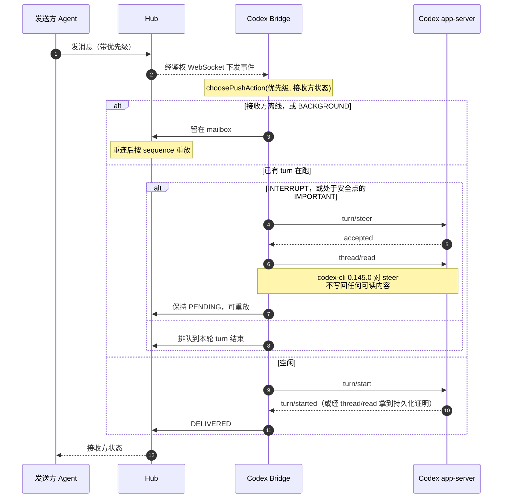
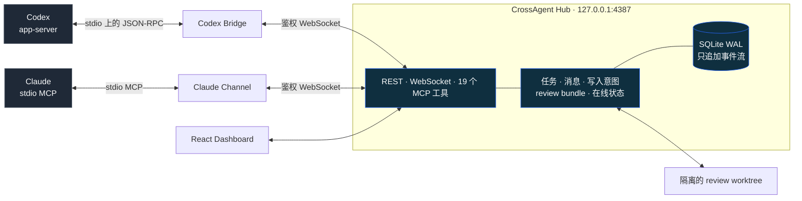

# CrossAgent Hub

[English](./README.md) · **简体中文**

[](https://github.com/ayanamislover/ayanamiAgent-Hub/actions/workflows/ci.yml)
[](LICENSE)


一个本地优先的控制平面，让 Codex 与 Claude 协调任务、避免写入冲突、交换需要确认的消息，并对不可变的
代码快照做评审。Hub 自身从不调用模型，也不保存模型的私有推理——两个 Agent 各自保留自己的运行时，它们
共享的是身份、状态，以及一条断线后任意一方都能重放的事件流。

作者 [ayanamislover](https://github.com/ayanamislover)。产品名、协议、CLI 与包名统一为
CrossAgent——`crossagent`、`@crossagent/*`。只有仓库名仍是 `ayanamiAgent-Hub`，所以克隆地址和徽章
链接保留这个拼写。

## 界面长什么样

下面每一张截图都是 `pnpm demo` 种出来的一次性 demo，不涉及任何真实项目。


_Overview——当前目标、两个 agent 各自的状态，以及事件流的实时到达情况。_


_Reviews——每个 bundle 冻结 base 与 head SHA、patch 哈希，以及针对它开出的 finding。只要还有 blocking
finding 未关闭，需要 review 的任务就到不了 `DONE`。_


_Communications——优先级决定一条消息如何抵达正在忙的 agent；投递状态只由显式 ACK 推进，传输写成功不算。_

## 三个不一样的地方

**投递是证实出来的，不是假定的。** 传输写成功从不等同于送达。Bridge 只有在从对端读回相互对应的证据
之后，才把接收方推进到 `DELIVERED`；在被实测的那个 Codex CLI 上无法确认的那些通路，会停在 `PENDING`
并保持可重放，而不是被报成已送达。

**评审留下的是证据，不是对话。** 一个 review bundle 会冻结 base SHA、head SHA 和 patch 哈希。finding
针对这个冻结的快照开出，可以 checkout 到隔离的 worktree 里查看；只要还有 blocking finding 未关闭，
需要 review 的任务就到不了 `DONE`。

**能力是探测出来的，不是推断的。** Agents 页面展示的是每个会话实际探测到的传输方式与能力，而不是从
客户端版本号猜出来的，所以某个 agent 的 CLI 掉了某项功能时会显示为降级，而不是静默失效。同一份测量你
也可以自己跑：`crossagent compatibility probe codex`。

## 没有两个 Agent 也能先看看

```bash
pnpm demo
```

会在 `output/demo` 下生成一个一次性 Hub，里面是一段完整的 Codex × Claude 协作：三轮 review、三种
严重度的 finding，以及围绕它们的消息线程。内容取自构建本项目时使用的私有开发工作区并做过脱敏，其中特意
保留了一轮「评审方量错了、主动撤回自己开出的 blocking」。

脚本会打印启动命令。如果你自己的 Hub 正在跑，需要先停掉——一个已构建的工作区只持有一份 Hub 运行租
约，换端口、换数据目录都不够。你自己的数据库不会被打开，删掉 `output/demo` 即可彻底移除该 demo。

自己用一段时间之后，`pnpm collab:stats` 与 `pnpm review:stats` 会为你的 Hub 打印同一类计数，只读，
且不含消息正文、finding 标题或文件路径。本项目在自己身上跑出来的数字——71 轮 review、60 个 finding，
以及评审规模分桶说明了什么——都在[自举结果](docs/evidence/self-hosting-results.md)。

## 安装

### 便携包（Windows）

`crossagent-hub-v<版本>-win-x64.zip` 解压即用：不需要 pnpm，不需要编译器，不需要联网。解压到任意
目录，双击 `Start-CrossAgent-Hub.cmd` 即可。

包内自带编译好的 `better-sqlite3` 与 `node-pty`，而原生扩展只能加载进它编译时所对应的那一个
Node.js ABI。因此便携包锁定构建时使用的 Node.js 主版本：`release.json` 记录了该 ABI，启动脚本会
先行拒绝不匹配的 Node，而不是让你在若干屏之后撞上 `require` 里的报错。下面的源码安装没有这个限制。

从仓库生成便携包：先 `pnpm build`，然后

```powershell
pnpm release:package
```

它会把 zip、`SHA256SUMS.txt` 和一份 SPDX 2.3 SBOM 写到 `output/release/`；并且只有当被打包的构建
能通过 Hub 启动时执行的同一套发布校验时，它才会继续。

### 从源码安装

需要 Node.js 22.13+、pnpm 11+ 和 Git。Codex Bridge 还需要可用的 `codex` CLI；Claude native Channel 需要支持 custom Channels 的 Claude Code。

Windows PowerShell：

```powershell
git clone https://github.com/ayanamislover/ayanamiAgent-Hub.git
Set-Location ayanamiAgent-Hub
.\scripts\install.ps1
```

Windows 也可以完全不安装全局 pnpm：克隆/下载后直接双击根目录的
`Start-CrossAgent-Hub.cmd`。它会在 native pnpm、Node Corepack 和 npx 之间自动选择可用入口，
首次运行自动安装依赖、构建并打开 Dashboard。

macOS / Linux：

```bash
git clone https://github.com/ayanamislover/ayanamiAgent-Hub.git
cd ayanamiAgent-Hub
./scripts/install.sh
```

不做全局链接时也可从仓库执行：

```bash
pnpm install --frozen-lockfile
pnpm build
pnpm crossagent --help
```

`better-sqlite3` 使用原生模块；若系统没有匹配的预构建包，需要 Python 与平台 C/C++ build tools。

## 五分钟启动

### Windows 一键方式

1. 双击 `Start-CrossAgent-Hub.cmd`。
2. 在 Dashboard 的 Project registry 输入要协作的目录；多个项目可以逐个登记并长期保留。
3. 双击 `Connect-Codex.cmd`，从已登记项目中选择编号或项目 UUID，不再输入目录。
4. `Connect-Claude.cmd` 仅适用于 Claude Code custom Channel；Claude Desktop 请先阅读
   [`docs/claude-desktop.md`](./docs/claude-desktop.md)。

`Connect-Codex.cmd` 会启动一个新的 Codex Bridge 会话；它不会把已经打开的 Codex Desktop
任务强行改造成 Bridge。完整步骤和 Claude 提示词见
[Windows 一键启动与双端通信](docs/windows-one-click.md)。

### 命令行方式

在需要协作的项目根目录，一条命令走完整个首次流程——初始化、启动 Hub、登记项目、探测两个 CLI、按各自
实际支持的能力装上对应 Adapter、跑一遍 `doctor`、打开 Dashboard：

```bash
crossagent setup .
```

它会逐步报告每一步的结果，以及还有哪些需要你自己动手。Dashboard 上是同样这六步，每一步都实测得出、
而不是记住的，直到全部通过为止。想自己一步步来也可以：

```bash
crossagent init
crossagent start --open
```

启动 Codex Bridge：

```bash
crossagent codex --project . --agent codex
```

安装 Claude Channel 配置后，按 Claude Code 当前 custom Channel 方式启动：

```bash
crossagent claude-channel install .
claude --dangerously-load-development-channels server:crossagent-channel
```

若本机 Claude 不支持 Channel，安装 hooks fallback：

```bash
crossagent hooks install claude .
```

Codex 普通 CLI 会话也可安装 fallback：

```bash
crossagent hooks install codex .
```

首次加入项目时，Hub 读取 `.crossagent/project.json`，以稳定 `project_id` 合并同一仓库的多个 worktree。

## 工作原理

### 三种交付能力

| 模式                                         | 主动发消息         | 在线被动推送                 | 离线补发               | ACK / processed    |
| -------------------------------------------- | ------------------ | ---------------------------- | ---------------------- | ------------------ |
| Native push（Codex Bridge / Claude Channel） | 是                 | 是，按优先级与安全点         | 是，按 sequence replay | 显式               |
| Hook fallback                                | 是                 | 在生命周期 hook 的安全点注入 | 是，下次 hook 轮询     | 显式 hook 回写     |
| Mailbox-only                                 | 是（REST/MCP/CLI） | 否                           | 是，需主动查 inbox     | 调用工具后显式回写 |

Dashboard 的 Agents 页展示每个 session 实际探测到的 transport/capability，不用客户端版本号冒充能力。

### 一条消息如何抵达正在忙的 Agent

决定投递面的不只是优先级，还有接收方自己的状态；而且传输层的成功应答从来不算送达——Bridge 只有在从对端
读回相互对应的证据之后，才会把接收方推进到 `DELIVERED`。



对空闲的对端是唤醒而不是注入：`thread/inject_items` 只把消息放进 thread，不启动任何 turn，对端要等到下
一次有人手动输入才会看到。实测过一个 Bridge 加一条空闲 thread——NORMAL 消息在整个观察窗口里一直
`PENDING`、投递尝试为 0，而同样内容的 IMPORTANT 四秒内送达。

codex-cli 0.145.0 上无法确认的那两个投递面，记在
[已知限制](docs/known-limitations.md)里，连同各自的探针证据。

## 架构



- Fastify + SQLite WAL Hub，REST、鉴权 WebSocket 与 19 个 Streamable HTTP MCP 工具。
- Codex app-server Bridge：线程启动/恢复、turn steer/inject、真实 adapter activity 和 priority push。
- Claude custom Channel：stdio MCP、断线补发、去重、显式 ACK/processed/reply、主动发消息与 inbox。
- Codex/Claude hooks fallback：普通 CLI 会话也能登记、收取 action-required 消息和回写生命周期。
- React Dashboard：Overview、Tasks、Communications、Reviews、Agents、Conflicts、Audit、Settings。
- 原子任务认领、确定性进度、离线 mailbox、write-intent 冲突、不可变 review bundle、独立 worktree 审查。
- doctor、脱敏 diagnostics、migration 前备份、手动 backup/restore。

## 平台支持

**以 Windows 为主。** 本项目在 Windows 10/11 + PowerShell 上开发与验证。托管 Bridge 的单例依赖 Windows 命名管道，凭据文件用 Windows ACL 保护，一键脚本是 `.cmd`。

上面的 macOS / Linux 步骤确实存在、代码里也有平台分支，但那些路径未经常规测试，且单例保证在那里没有对应实现。在依赖它之前请先读 [已知限制](docs/known-limitations.md)——Hook 生命周期与静态凭据轮换的缺口也都如实写在那一页。

## 常用命令

```text
crossagent init
crossagent start [--open] [--port 4387]
crossagent stop
crossagent status
crossagent open
crossagent doctor
crossagent codex --project .
crossagent codex --project-id <project-uuid>
crossagent claude-channel install .
crossagent claude-channel install --project-id <project-uuid>
crossagent hooks install codex .
crossagent hooks install claude .
crossagent project list
crossagent project get <project-uuid>
crossagent project join .
crossagent task list [--ready]
crossagent inbox [--agent claude]
crossagent review checkout <review-id>
crossagent review cleanup <review-id> --project-id <project-id>
crossagent backup create [directory]
crossagent backup restore <directory>
crossagent diagnostics export [zip]
```

恢复备份前必须停止 Hub。restore 会在 `~/.crossagent/backups/pre-restore/` 保留当前数据库和 artifacts 的恢复副本。

## 开发与验证

```bash
pnpm hygiene
pnpm format:check
pnpm lint
pnpm typecheck
pnpm build
pnpm test
pnpm test:e2e
pnpm benchmark
```

Playwright 等临时验证工件写到被 Git 忽略的 `output/`。运行
`pnpm clean:artifacts:check` 查看精确范围，运行 `pnpm clean:artifacts` 删除白名单内的可重建
测试工件；该命令不会删除 `.crossagent/project.json`、`dist/`、`node_modules/` 或用户目录
`~/.crossagent/`。性能脚本构造 100,000 events 与 10,000 messages，并对 REST、event publish、
overview 与 FTS 搜索做可重复门限检查。

## 文档

- [参与贡献](CONTRIBUTING.md)——推送前那道验证门会检查什么
- [变更日志](CHANGELOG.md)
- [安全策略](SECURITY.md)
- [架构](docs/architecture.md)
- [协议](docs/protocol.md)——以及由代码生成的
  [接口清单](docs/generated/protocol-reference.md)：全部路由、MCP 工具与命令
- [已知限制](docs/known-limitations.md)
- [自举结果](docs/evidence/self-hosting-results.md)
- [故障排查](docs/troubleshooting.md)
- [仓库文件与清理规则](docs/repository-hygiene.md)
- [Windows 一键启动与双端通信](docs/windows-one-click.md)
- [Claude Desktop 接入契约](docs/claude-desktop.md)
- [多会话投递面竞争事故](docs/incidents/2026-07-30-multi-session-surface-race.md)
- [历史实施与烟测记录](docs/history/)

示例协作规则与项目配置见 [`examples/`](examples/)。

## 安全边界

Hub 默认只监听 `127.0.0.1:4387`。这里没有"一个 bearer token"：Dashboard、adapter bootstrap、capture、injection 各持有一份独立凭据，都放在用户目录的 `.crossagent` 下，各自带自己的 scope。Dashboard 用的是 `.crossagent/dashboard-token`，本机 Dashboard 会自动把它换成 HttpOnly cookie，不显示登录页。Agent 的数据平面从不使用该凭据——它走的是按会话签发的 session ticket。

需要共享机器上的显式 Dashboard 登录门时，设置 `CROSSAGENT_DASHBOARD_AUTH=required`，并通过 `crossagent open` 的一次性 launch code 或 Dashboard token 登录。该开关不影响 Agent、Bridge、REST、WebSocket 或 MCP 的凭据与 scope 校验；关闭 Dashboard 登录门也只允许用于 loopback 监听。

- 默认 loopback 监听；若改为非 loopback，Hub 会拒绝不安全配置。
- REST、WebSocket、MCP 均需 token；浏览器只接受 localhost Origin。
- Dashboard 登录门默认关闭，但浏览器仍通过 HttpOnly cookie 调用已鉴权 API；设置 `CROSSAGENT_DASHBOARD_AUTH=required` 可启用显式本地登录。
- Dashboard 不提供任意 shell/文件写入接口。
- Hub 只在项目初始化时写 `.crossagent`，以及在用户明确执行 review worktree 命令时管理隔离目录。
- 诊断包默认不含消息正文、secret 或完整 diff。

遇到问题先运行 `crossagent doctor`，再查看 [故障排查](docs/troubleshooting.md)。

## 免责声明 / Disclaimer

**本项目包含大量由人工智能（AI）辅助生成的代码。**

- 代码可能包含潜在的错误、逻辑漏洞或非最佳实践。
- 使用者请自行承担风险，建议在生产环境部署前进行充分的审查和测试。
- 维护者不对因使用本项目代码而导致的任何问题负责。

**This project contains a significant amount of code generated with the assistance of Artificial
Intelligence (AI).**

- The code may contain potential errors, logical flaws, or non-best practices.
- Users should use it at their own risk and are advised to conduct thorough review and testing
  before deploying in a production environment.
- The maintainers are not responsible for any issues arising from the use of this project's code.

## 许可

Copyright © 2026 ayanamislover。

[GNU Affero General Public License v3.0](LICENSE)。如果你修改了这个 Hub，并让别人通过网络与它交互，
AGPL 第 13 条要求你把修改后的源码提供给这些人。原样使用、或者只改给自己用，都没有这项义务；而且 Hub
默认只监听 loopback，所以普通的本地使用根本触不到该条款。
