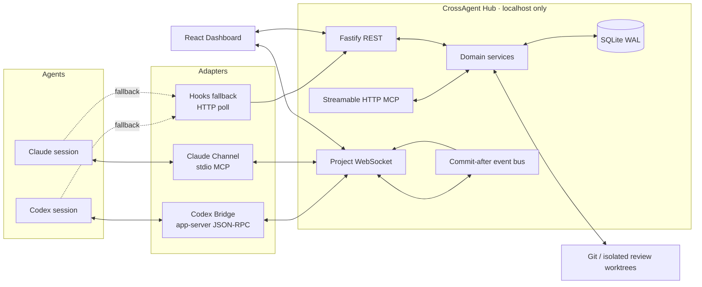

# CrossAgent Hub Architecture

## Purpose

CrossAgent Hub is a local-first coordination substrate for Codex and Claude. It does not assign work with an LLM. It gives autonomous agents a shared, auditable set of deterministic coordination primitives: identity, presence, tasks, messages, write intents, immutable review bundles, and an append-only event stream.

The system optimizes for four properties:

1. reliable delivery with an offline mailbox;
2. low interruption through priority-aware push;
3. auditable state derived from real events;
4. recovery after adapter, process, or WebSocket failure.

## System shape



## Repository boundaries

- `packages/protocol`: Zod schemas, enums, shared transport types, deterministic progress and priority helpers.
- `packages/client`: authenticated REST/WebSocket client used by CLI and adapters.
- `apps/hub`: database, migrations, repositories, domain services, REST, WebSocket, MCP, security, and static Dashboard serving.
- `packages/codex-bridge`: Codex app-server JSONL client, event mapping, capability probes, push policy, reconnect.
- `packages/claude-channel`: stdio MCP Channel, Hub WebSocket subscription, ACK/processed/reply tools, reconnect and dedupe.
- `packages/hooks`: one portable Node hook command plus installers for Codex and Claude.
- `packages/cli`: user-facing `crossagent` command, process lifecycle, doctor, diagnostics, backup, review worktrees.
- `apps/dashboard`: React/Vite product UI.

Domain code never imports Codex- or Claude-specific types. Version differences stay behind adapter interfaces.

## Trust and persistence

SQLite is the single source of truth. Projection rows and their corresponding domain event are written in the same transaction. WebSocket publication only occurs after commit. Project-local monotonically increasing sequence numbers let clients repair gaps.

The database enables:

```sql
PRAGMA journal_mode = WAL;
PRAGMA synchronous = NORMAL;
PRAGMA foreign_keys = ON;
PRAGMA busy_timeout = 5000;
```

High-frequency transport heartbeats update the current session row. They do not append an unbounded event for every sample. State changes, claim staleness, delivery changes, and failures do append events.

## Identity model

A project is identified by `.crossagent/project.json`, not by an absolute path. Every worktree registers its own canonical path alias against the same project ID.

An Agent is a durable logical identity (`codex`, `claude`, or another string). A Session is one concrete runtime with a role, client type, transport, cwd, Git state, connection state, and work state. Connection and work states remain independent.

## Message delivery

Every message has a recipient row and zero or more delivery attempts. A transport write or
app-server RPC result alone is not delivery evidence. A push Adapter advances the recipient to
`DELIVERED` only after its target exposes correlated durable acceptance evidence; an ambiguous
result stays replayable and degrades Adapter health. Only explicit tool/hook callbacks advance
`ACKNOWLEDGED`, `PROCESSED`, or `RESPONDED`.

Push behavior is deterministic. `choosePushAction` reads the priority and the recipient's own state
— online, mid-turn, at a safe checkpoint, and its wake policy — and returns one surface:

- `BACKGROUND`, or any priority to an offline recipient: mailbox and Dashboard only.
- Mid-turn: `INTERRUPT` steers; `IMPORTANT` steers at a safe checkpoint and queues otherwise;
  `NORMAL` queues until the turn ends.
- Idle: `NORMAL` and `INTERRUPT` wake. `IMPORTANT` wakes unless the recipient's wake policy opted
  out, which is the only remaining route to an injection.

An idle recipient is woken rather than injected into. `thread/inject_items` places the message in
the thread but starts no turn, so the peer sees it only when a human next types, and on codex-cli
0.145.0 nothing can read the item back to confirm it. Waking an idle peer means starting a turn.

`docs/known-limitations.md` records which surfaces can be confirmed on that Codex version and the
probe evidence for each. Steer and inject cannot be, so their messages stay `PENDING` and
replayable; only a wake carries durable proof, because `turn/start` is the one surface Codex
persists a client message id for.

## Review immutability

A review bundle freezes `base_sha`, `head_sha`, a patch artifact, patch SHA-256, changed files, acceptance criteria, test evidence, and author claims. A committed bundle checks out its head in a detached worktree. An uncommitted bundle checks out the recorded head and applies the stored patch; the live workspace is never the review source.

A changed head or patch creates a new revision and marks the old review `SUPERSEDED`. A review-required task reaches `DONE` only after approval and no open blocking finding.

## Security model

- Hub binds to `127.0.0.1` by default.
- A high-entropy bearer token is stored below the user data directory and required by REST, WebSocket, Dashboard, and MCP.
- `Origin` is rejected unless absent or explicitly localhost.
- Paths are canonicalized and must remain below a registered project root or managed review-worktree root.
- Dashboard exposes domain actions only; it has no arbitrary command endpoint.
- Artifact and message sizes are bounded.
- Hub logs redact bearer-token header and query-string fields before serialization.
- Agent-authored content is wrapped as untrusted collaboration data, never as a system instruction.

## Recovery model

- stale PID files are verified using process existence and the recorded command/port before replacement;
- clients reconnect with exponential backoff and their last project sequence;
- WebSocket gap events are replayed before live subscription;
- bounded queues emit `resync_required` rather than silently dropping;
- database backups are created before migrations and can be restored through the CLI;
- adapters expose capability probes and an honest delivery mode (`app_server_push`, `native_channel`, `hook_poll`, `mailbox_only`).
